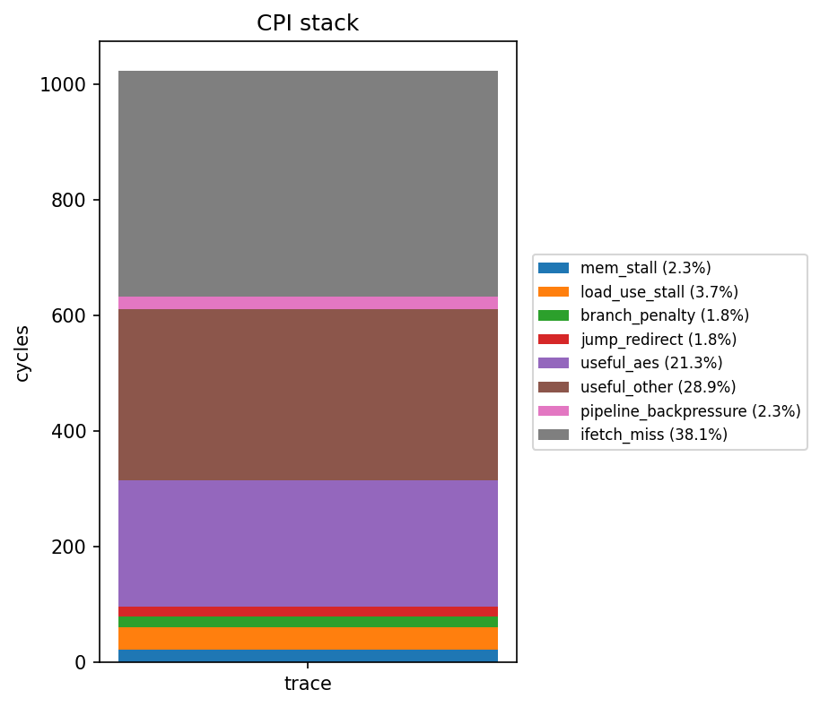
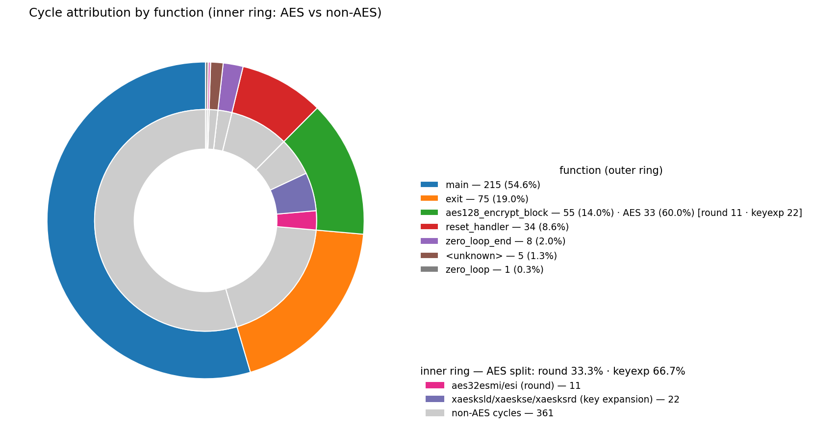

# PDP Project — Speeding up AES-128 on CV32E40P / PYNQ-Z1

TU Delft CESE — Processor Design Project (CESE4040). The goal of this project is to **speed up AES-128 (ECB) on a CV32E40P (RI5CY) soft-core running on the PYNQ-Z1**, by co-designing the hardware and the software/toolchain. The pre-optimization snapshot is preserved on the `baseline` branch for A/B comparison; `main` carries the current optimization state.

This README documents the optimizations implemented **so far**. Further optimizations are planned and the README will be updated as they land.

### optimizations currently in place

The accelerator has evolved through two layers. The current `main` kernel drives the **round-wise** layer; the earlier **byte-wise** layer is retained in HW and behind a build flag for bring-up diffing.

- **Round-wise AES-128 state engine in HW** (`xaesstld` / `xaesrnd` / `xaesstrd`, unit `cv32e40p_aes_state.sv`). The 128-bit cipher state lives in a hidden register inside the core and advances by **one full FIPS-197 forward round per cycle** (SubBytes → ShiftRows → MixColumns → AddRoundKey).
- **On-the-fly key schedule in HW** (`xaesksld` / `xaeskse` / `xaesksrd`, unit `cv32e40p_aes_ks.sv`). The 128-bit round key lives in a second hidden register; `xaeskse` advances it to the next round key in one cycle. The state engine reads the live round key **directly** from this unit, so middle/final rounds need no GPR operands and no round-key buffer in memory.
- **Byte-wise scalar-crypto instructions** (`xaes32esmi`, `xaes32esi`, units `cv32e40p_aes.sv` / `cv32e40p_aes_fi.sv`) — combinational, Zkne-encoding-compatible. These were the first optimization layer; they remain in the ALU and are reachable from C behind `-DREFERENCE_BYTEWISE`.
- **LLVM/clang toolchain extensions** that expose all of the above as `__builtin_riscv_…` intrinsics, so the C kernel emits them directly with no inline asm or library call.
- **A round-wise AES-128 ECB kernel** ([aes128_encrypt_block](software/main.c#L213)) that loads the state, runs round 0 (AddRoundKey-only), a **`#pragma clang loop unroll(full)`** 9-iteration `aeskse`→`aesrnd` loop, the final round, then reads the ciphertext back — **33 AES-extension instructions per block** (down from 218 on the byte-wise path).

---

## Current optimizations (HW + Toolchain + Kernel)

| # | Technique | Where | Effect |
|---|-----------|-------|--------|
| 1 | `xaesrnd` round engine in HW (SBox + ShiftRows + MixColumns + AddRoundKey on a hidden 128-bit state register, one round/cycle) | [cv32e40p_aes_state.sv](hardware/src/design/riscy/cv32e40p_aes_state.sv), [cv32e40p_alu.sv:144](hardware/src/design/riscy/cv32e40p_alu.sv#L144) | One full AES round per instruction; `mode` selects middle / final / AddRoundKey-only |
| 2 | `xaesstld` / `xaesstrd` state load/read | [cv32e40p_aes_state.sv](hardware/src/design/riscy/cv32e40p_aes_state.sv) | Plaintext columns loaded into / ciphertext columns read out of the hidden state register (4 words each) |
| 3 | `xaeskse` on-the-fly key schedule in HW (hidden 128-bit round-key register, internal Rcon counter) | [cv32e40p_aes_ks.sv](hardware/src/design/riscy/cv32e40p_aes_ks.sv), [cv32e40p_alu.sv:119](hardware/src/design/riscy/cv32e40p_alu.sv#L119) | Eliminates the software key-expansion table and the 176-byte round-key buffer; round key is computed between rounds |
| 4 | Direct key→state AddRoundKey wiring | [cv32e40p_alu.sv:144-153](hardware/src/design/riscy/cv32e40p_alu.sv#L144-L153) | The state unit's AddRoundKey reads the live round key (`krk_i`) straight from the key unit — no GPR shuttling, no `xaesksrd` in the hot loop |
| 5 | Round-wise encrypt loop, fully unrolled | [main.c:213-260](software/main.c#L213-L260) | `aeskse`→`aesrnd(0)` per middle round; `#pragma clang loop unroll(full)` makes the `aeskse`→`aesrnd` ordering branch-free so the pipeline can never reorder a key-expand past its round consumer |
| 6 | Byte-wise `xaes32esmi` / `xaes32esi` (combinational, S-box + optional MixColumns + rotate + XOR) | [cv32e40p_aes.sv](hardware/src/design/riscy/cv32e40p_aes.sv), [cv32e40p_aes_fi.sv](hardware/src/design/riscy/cv32e40p_aes_fi.sv) | First optimization layer; retained in HW and behind `-DREFERENCE_BYTEWISE` in [main.c:122-194](software/main.c#L122-L194) for A/B diffing against the round engine |
| 7 | Custom LLVM extensions for all four families (clang builtins → single insn) | [patches/](patches/) | `-march=rv32imac_zicsr_xaes32esmi_xaes32esi_xaeskeyexp_xaesstate` lowers each builtin directly to one encoded instruction |

---

## Comparison with Baseline

The `baseline` branch contains the original purely-software AES-128 (sbox table lookup + GF(2⁸) `gf_mult` + `mix_columns` + `shift_rows` + software `expand_key`). The table below describes what the **current** round-wise state engine *structurally removes* from the binary, relative to that baseline; the per-function trace numbers come from [profile_attribution.csv](hardware/src/simulation/profile_attribution.csv). Future optimizations will be compared incrementally on top of this state.

| Aspect | Baseline (`baseline` branch) | optimized (`main` branch) |
|---|---|---|
| ISA target | `-march=rv32imac_zicsr` | `-march=rv32imac_zicsr_xaes32esmi_xaes32esi_xaeskeyexp_xaesstate` |
| `mix_columns` function | Hot — 86.86 % of retired instructions in the baseline, dominated by `gf_mult` | Eliminated from the binary — folded into HW MixColumns inside `cv32e40p_aes_state` |
| `gf_mult` (GF(2⁸) multiply) | Called 4×4×8 times per round per block; dominates the `slli`/`xor`/`srai`/`andi` opcode mix | Eliminated from the binary |
| `shift_rows` / `sub_bytes` | Explicit software byte-shuffle + 256-byte S-box LUT | Eliminated — done inside the HW round engine (S-box synthesises to FPGA LUTs) |
| `expand_key` (key schedule) | Software, produces a 176-byte round-key buffer in memory | Eliminated — `xaeskse` advances a hidden round-key register one round at a time; reference kept behind `-DREFERENCE_KEYEXP` |
| Inner-round control flow | Loop `for round in 1..9` with runtime counter and back-edge branch | Loop fully unrolled at compile time (`#pragma clang loop unroll(full)`) — counter + branch removed |
| AES instructions per block | n/a (pure software, thousands of dynamic insns) | **33** AES-extension instructions per block; `aes128_encrypt_block` is **46 insns / 55 cycles** total (per the current trace) |
| HW cost added | — | Two hidden-state units (`cv32e40p_aes_ks`, `cv32e40p_aes_state`) plus the two combinational byte-wise units (`cv32e40p_aes`, `cv32e40p_aes_fi`) in the EX stage |

---

## Architecture

### Scalar-Crypto ALU Hooks

All four AES units sit inside [cv32e40p_alu.sv](hardware/src/design/riscy/cv32e40p_alu.sv) and run in parallel with the rest of the ALU. The two **byte-wise** units are purely combinational and feed the `result_o` mux directly:

```systemverilog
// cv32e40p_alu.sv (byte-wise, combinational)
cv32e40p_aes    aes_i    ( .rs1_i(operand_a_i), .rs2_i(operand_b_i),
                           .bs_i(imm_vec_ext_i), .result_o(aes_result) );
cv32e40p_aes_fi aes_fi_i ( .rs1_i(operand_a_i), .rs2_i(operand_b_i),   // final round, no MixColumns
                           .bs_i(imm_vec_ext_i), .result_o(aes_fi_result) );
```

The two **stateful** units hold hidden registers and are *commit-gated* — their sequential update fires exactly once per instruction, even under an EX-stage stall, via `enable_i & ex_ready_i`:

```systemverilog
// cv32e40p_alu.sv:119-153
cv32e40p_aes_ks aes_ks_i (              // hidden 128-bit round-key register
    .clk(clk), .rst_n(rst_n),
    .ld_en_i (aes_ks_ld_en),            // = commit & (operator_i == ALU_XAESKSLD)
    .exp_en_i(aes_ks_exp_en),           // = commit & (operator_i == ALU_XAESKSE)
    .widx_i  (imm_vec_ext_i),
    .wdata_i (operand_a_i),
    .rdata_o (aes_ks_rdata),
    .krk_full_o(aes_ks_krk_full)        // live round key, wired into the state unit
);

cv32e40p_aes_state aes_state_i (        // hidden 128-bit cipher-state register
    .clk(clk), .rst_n(rst_n),
    .ld_en_i (aes_st_ld_en),            // = commit & (operator_i == ALU_XAESSTLD)
    .rnd_en_i(aes_st_rnd_en),           // = commit & (operator_i == ALU_XAESRND)
    .mode_i  (imm_vec_ext_i),           // xaesrnd packs mode into instr[31:30]
    .sidx_i  (imm_vec_ext_i),           // xaesstld/xaesstrd pack sidx the same way
    .wdata_i (operand_a_i),
    .krk_i   (aes_ks_krk_full),         // AddRoundKey source — no GPR shuttling
    .rdata_o (aes_st_rdata)
);
```

The 2-bit `bs` / `widx` / `sidx` / `mode` field lives in `instr[31:30]` for every AES instruction and is routed to the ALU through the otherwise-unused `imm_vec_ext` channel — no new pipeline wires required.

Internal control codes (not RISC-V opcodes) are added to `alu_opcode_e` in [cv32e40p_pkg.sv:170-186](hardware/src/design/riscy/include/cv32e40p_pkg.sv#L170-L186):

```systemverilog
ALU_AES32ESMI = 7'b1000000,   ALU_AES32ESI  = 7'b1000001,   // byte-wise
ALU_XAESKSLD  = 7'b1000010,   ALU_XAESKSE   = 7'b1000011,   ALU_XAESKSRD = 7'b1000100,  // key schedule
ALU_XAESSTLD  = 7'b1000101,   ALU_XAESRND   = 7'b1000110,   ALU_XAESSTRD = 7'b1000111   // round-wise state
```

### Instruction Decoding

[cv32e40p_decoder.sv:601-689](hardware/src/design/riscy/cv32e40p_decoder.sv#L601-L689) matches all eight AES instructions inside `OPCODE_OP` (`0x33`) **before** the PULP bit-manip / vec-FP branches, because the 2-bit index occupies `instr[31:30]` and would otherwise alias with those decode prefixes. They share `funct3 = 000` and are disambiguated by `funct5` (`instr[29:25]`):

| Instruction | `funct5` | Operands | Action |
|---|---|---|---|
| `xaes32esmi` | `10011` | rd, rs1, rs2, bs | byte-wise SBox + MixCol (Zkne-compatible) |
| `xaes32esi`  | `10001` | rd, rs1, rs2, bs | byte-wise SBox only (final round) |
| `xaesksld`   | `10010` | rs1, widx | `krk[widx] <= rs1` (seed key word) |
| `xaeskse`    | `10000` | — | `krk <= KeyExpand(krk)` (next round key) |
| `xaesksrd`   | `10100` | rd, widx | `rd <= krk[widx]` (read key word) |
| `xaesstld`   | `10101` | rs1, sidx | `st[sidx] <= rs1` (load state word) |
| `xaesrnd`    | `10110` | mode | `st <= round(st, krk)` (one full round) |
| `xaesstrd`   | `10111` | rd, sidx | `rd <= st[sidx]` (read state word) |

The `xaes32esmi`/`xaes32esi` encodings are bit-identical to the standard Zkne ones; the custom feature flags in the LLVM patches exist only so each family can be enabled without pulling in the rest of Zkne.

### Round Engine Datapath ([cv32e40p_aes_state.sv](hardware/src/design/riscy/cv32e40p_aes_state.sv))

The state unit holds the 128-bit cipher state as four words `st_q[0:3]` and advances it one round per `xaesrnd`. A single `always_ff` writes all four words at once — this is a correctness requirement: ShiftRows for output column `c` reads `s[0][c], s[1][c+1], s[2][c+2], s[3][c+3]`, i.e. one byte from every *old* column, so the whole state must be latched simultaneously or a partial update would leak overwritten bytes into later columns.

The 2-bit `mode` picks the round flavour:

```
mode = 0 : middle round  SubBytes -> ShiftRows -> MixColumns -> AddRoundKey
mode = 1 : final round   SubBytes -> ShiftRows -> AddRoundKey  (no MixColumns)
mode = 2 : AddRoundKey-only (round 0)
```

`AddRoundKey` XORs in `krk_i`, the live 128-bit round key driven straight from `cv32e40p_aes_ks`. MixColumns is built from `xtime` (a shift + conditional `0x1b` XOR) — no GF multiplier.

### Key-Schedule Datapath ([cv32e40p_aes_ks.sv](hardware/src/design/riscy/cv32e40p_aes_ks.sv))

The key unit holds the live round key `krk_q` and advances it with one FIPS-197 AES-128 expand step per `xaeskse` (little-endian words):

```
rot = ROR32(k3, 8)                 # RotWord
sub = SBox per byte of rot         # SubWord
g   = sub ^ {24'b0, Rcon[rcnt]}    # Rcon into byte 0
n0 = k0 ^ g;  n1 = k1 ^ n0;  n2 = k2 ^ n1;  n3 = k3 ^ n2
```

The Rcon constant is selected by an internal counter `rcnt_q`, so `xaeskse` needs no operand: a key load (`xaesksld`) resets the counter to 0, each expand consumes `Rcon[rcnt]` and increments. Round keys are therefore produced strictly in order (round 1..10), which the unrolled software loop guarantees.

### Software Round-Wise Encryption

[aes128_encrypt_block](software/main.c#L213) is one block of AES-128 expressed entirely in terms of the two hidden registers:

```c
// load plaintext columns into the state register (fire-and-forget)
aesstld(pin[0], 0); aesstld(pin[1], 1); aesstld(pin[2], 2); aesstld(pin[3], 3);
// seed the key register with the cipher key (a load also resets the Rcon counter)
aesksld(kin[0], 0); aesksld(kin[1], 1); aesksld(kin[2], 2); aesksld(kin[3], 3);

aesrnd(2);                       // round 0: AddRoundKey-only with the cipher key

#pragma clang loop unroll(full)  // middle rounds 1..9
for (int round = 1; round < 10; round++) {
    aeskse();                    // advance key register to round key `round`
    aesrnd(0);                   // consume it: SBox+ShiftRows+MixCol+AddRoundKey
}

aeskse();  aesrnd(1);            // final round 10: no MixColumns
cout[0] = aesstrd(0); cout[1] = aesstrd(1); cout[2] = aesstrd(2); cout[3] = aesstrd(3);
```

The full unroll makes the `aeskse`→`aesrnd` ordering branch-free, so the pipeline can never reorder a key-expand past the round that consumes it. The total is **33 AES-extension instructions per block**: 4 `aesstld` + 4 `aesksld` + 11 `aesrnd` (rounds 0..10) + 10 `aeskse` + 4 `aesstrd`.

The byte-wise `aes_inner_round` / `aes_final_round` ([main.c:122-194](software/main.c#L122-L194)) — chained `aes32esmi` / `aes32esi` with the `(c+r) mod 4` ShiftRows index pattern — are the previous layer, kept behind `-DREFERENCE_BYTEWISE` so their output can be diffed against the round engine during bring-up.

### Toolchain Wiring

[software/include/aes_intrinsics.h](software/include/aes_intrinsics.h) wraps each clang builtin behind a small switch so call sites can pass a *runtime* index/mode even though the builtin requires a compile-time constant — the compiler collapses each call back to one instruction. The stateful builtins (`xaesksld`/`xaeskse`/`xaesksrd`, `xaesstld`/`xaesrnd`/`xaesstrd`) are declared `IntrInaccessibleMemOnly + IntrHasSideEffects` in the LLVM patches so the optimizer keeps load → expand/round → read ordered and never deletes the void-returning ops as dead.

```c
static inline void aesrnd(int mode) {
    switch (mode & 0x3) {
    case 0:  __builtin_riscv_xaesrnd(0); break;  // middle round
    case 1:  __builtin_riscv_xaesrnd(1); break;  // final round (no MixColumns)
    case 2:  __builtin_riscv_xaesrnd(2); break;  // AddRoundKey-only (round 0)
    default: __builtin_riscv_xaesrnd(0); break;
    }
}
```

Per-family TableGen patches and their apply order are documented in each [patches/llvm-*/README.md](patches/). The four shared-file patches stack in order: `llvm-xaes32esmi` → `llvm-xaes32esi` → `llvm-xaeskeyexp` → `llvm-xaesstate`.

---

## Implementation Results (OOC Synth, Vivado, PYNQ-Z1)

The Vivado OOC-synth flow described under [Build & Bring-up](#build--bring-up) produces utilisation and timing reports under `hardware/vivado/ooc_riscy/ooc_riscy.runs/ooc_synth/`. **Quantitative area/timing numbers (LUTs, FFs, BRAMs, WNS) will be updated here.**

---

## Custom Instruction Encodings

All eight instructions reuse the standard RV32I `OP` opcode (`0110011`) and `funct3 = 000`, and are disambiguated by `funct5` (`instr[29:25]`). The 2-bit index/mode field is in `instr[31:30]`:

```
 31  30 29     25 24  20 19  15 14  12 11   7 6     0
+----+--------+------+------+------+------+-------+
|idx | funct5 | rs2  | rs1  | 000  | rd   |0110011|
+----+--------+------+------+------+------+-------+
       10011   xaes32esmi      10010   xaesksld
       10001   xaes32esi       10000   xaeskse
                               10100   xaesksrd
       10101   xaesstld
       10110   xaesrnd
       10111   xaesstrd
```

The `xaes32esmi`/`xaes32esi` encodings are bit-identical to the standard Zkne instructions; the custom feature names in LLVM only exist so we can enable them without enabling the rest of Zkne.

---

## Profiling & Methodology

The profiling pipeline reuses the per-cycle trace produced by [zynq_tb.sv](hardware/src/simulation/zynq_tb.sv) during RTL simulation and the linker symbol map produced by `make soft`.

### CPI-stack categories ([profile.py](software/python_script/profile.py))

Each cycle of `pipeline_trace.csv` is classified into exactly one bucket (priority-ordered, first match wins) — the `classify()` function writes the chosen bucket into the `category` column of `pipeline_trace_classified.csv`:

| Bucket | Condition |
|---|---|
| `mem_stall` | `data_req && !data_gnt` |
| `load_use_stall` | `id_stage.load_stall_o` (load-use RAW) |
| `jr_stall` | `id_stage.jr_stall_o` (JR hazard on rs1) |
| `misaligned_stall` | `id_stage.misaligned_stall_o` (split LSU access) |
| `branch_penalty` | `pc_set && branch_dec` (taken branch flush) |
| `jump_redirect` | `pc_set && !branch_dec` (JAL/JALR/exception) |
| `useful_execution` | `is_decoding && id_ready` (instr advanced) |
| `pipeline_backpressure` | `is_decoding && !id_ready` (downstream stall) |
| `ifetch_miss` | `!instr_valid_id && (if_busy || perf_imiss)` |
| `fetch_drain` | post-flush refill, `!instr_valid_id && !if_busy` |
| `other_bubble` | everything else |

The two stacks below are the **full-program** CPI breakdown — baseline (software AES) on the left, current round-wise build on the right. **Note the y-axes differ by ~150×** (0–60 000 vs 0–394 cycles): the bars are *not* drawn to a common scale.

<table>
<tr>
  <td align="center"><b>Baseline (software AES)</b></td>
  <td align="center"><b>Current (round-wise HW)</b></td>
</tr>
<tr>
  <td valign="top"></td>
  <td valign="top"></td>
</tr>
</table>

- **Total cycles fall from ≈ 59 590 to ≈ 394 (~150×).** The baseline is dominated by `useful_execution` (~37 k cycles — software `mix_columns` / `gf_mult`) and `ifetch_miss` (~18 k, the 2-cycle BRAM read latency on the instruction port). Folding AES into the HW round engine deletes almost all of that work.
- **AES is now 33 single-cycle instructions** — the `useful_aes` slice (8.4 %, ≈ 33 cycles), exactly the AES-extension op count per block. Everything the software kernel used to spend on S-box / MixColumns / key expansion is gone from the cycle count.
- **What remains (≈ 394 cycles) is mostly non-AES scaffolding:** `useful_other` (53.6 %, ≈ 211 cycles — `main`, I/O, `exit`, `reset_handler`) plus `ifetch_miss` (16.0 %, ≈ 63 cycles). The *absolute* `ifetch_miss` collapsed from ~18 k to ~63 cycles; its *share* rose only because the denominator shrank ~150×.
- **Fixed control overheads now surface:** `jump_redirect` (10.7 %), `load_use_stall` (6.9 %) and `branch_penalty` (4.6 %) were negligible fractions of the baseline. They are essentially unchanged in absolute terms — they are just no longer dwarfed by the AES kernel.
- `profile.py` now refines the single baseline `useful_execution` bucket into `useful_aes` vs `useful_other`, isolating the accelerator's contribution directly in the stack.

### Dynamic instruction & function profiling ([profile.py](software/python_script/profile.py))

For every cycle where an instruction retires (`is_decoding && id_ready`), the script attributes the retire to a function (via `software/aes.map` symbol ranges, looking up `pc_id`) and an opcode mnemonic (decoded from the raw `instr` bits, RV32IMC + Zicsr + the custom AES instructions). Outputs the per-function `profile_attribution.csv` and per-mnemonic `profile_opcodes.csv`. In the current trace `aes128_encrypt_block` retires 46 instructions in 55 cycles, 33 of them AES-extension ops (4 `xaesksld`, 10 `xaeskse`, 4 `xaesstld`, 11 `xaesrnd`, 4 `xaesstrd`).

<p align="center">
  
</p>

The donut shows cycle attribution across the whole run. **Outer ring** — cycles per function: `main` (54.6 %), `exit` (19.0 %), `aes128_encrypt_block` (14.0 %, 55 cycles), `reset_handler` (8.6 %), and minor startup/loop symbols. **Inner ring** — within the AES kernel, the split of the 33 AES-extension instructions between the round engine (`xaesstld`/`xaesrnd`/`xaesstrd`) and the on-the-fly key schedule (`xaesksld`/`xaeskse`). The encryption itself is no longer the hot path — `main` and program teardown (`exit`) now dominate the cycle budget.

---

## Build & Bring-up

This section is a condensed working reference. Detailed PYNQ board setup and server-environment instructions live in the [Run server](#run-server) / [Run locally](#run-locally) subsections below.

### Toolchain

| Tool | Where it lives | Build |
|---|---|---|
| RISC-V GCC | server: `/data/mirror/riscv` (`riscv32-unknown-elf`) | upstream `riscv-gnu-toolchain`, `--with-arch=rv32gc --with-abi=ilp32d` |
| LLVM/clang (custom) | server: `/data2/home/cese4040-10/Desktop/compiler/llvm/build-release` | upstream LLVM `f351172d…` + patches in `patches/llvm-xaes32esmi/`, `llvm-xaes32esi/`, `llvm-xaeskeyexp/`, `llvm-xaesstate/` |
| Vivado | local | 2024.2, free edition (PYNQ-Z1 target) |

Apply the LLVM patches **in dependency order** and rebuild only the RISCV backend:

```sh
cd /path/to/llvm-project
git checkout f351172d4a840dfbf533319b62925747a10b762f
git apply /path/to/pdp-project/patches/llvm-xaes32esmi/*.patch
git apply /path/to/pdp-project/patches/llvm-xaes32esi/*.patch
git apply /path/to/pdp-project/patches/llvm-xaeskeyexp/*.patch
git apply /path/to/pdp-project/patches/llvm-xaesstate/*.patch
cd build-release
cmake -G Ninja \
  -DLLVM_TARGETS_TO_BUILD="RISCV" \
  -DLLVM_ENABLE_PROJECTS="clang;lld" \
  -DCMAKE_BUILD_TYPE=Release \
  -DLLVM_BUILD_TESTS=OFF -DLLVM_INCLUDE_TESTS=OFF "../llvm/"
ninja -j4   # NB: bare `ninja` OOMs the procdesign server
```

### Software build

```sh
cd software
make soft
```

Generates `output/soft.elf` + `soft.srec`, then `bin_files/code.coe` and `bin_files/data.coe`, and copies the COE files into both `hardware/src/sw/mem_files/` (simulation) and `hardware/src/sw/fpga/riscy/mem_files/` (FPGA overlay). The active config — `software/config/rv32-standard.conf` — pins `-march=rv32imac_zicsr_xaes32esmi_xaes32esi_xaeskeyexp_xaesstate` and `-Os`. Build with `-DREFERENCE_BYTEWISE` / `-DREFERENCE_KEYEXP` to compile the byte-wise path / software key schedule back in for diffing.

### Hardware bring-up (Vivado)

All scripts assume your working directory is `pdp-project/hardware/`. From the Vivado tcl console:

```tcl
cd ./pdp-project/hardware
source ./scripts/create_project.tcl          # base block-design + sources
source ./run_simulation.tcl                  # behav sim, dumps pipeline_trace.csv
source ./run_synth_impl.tcl                  # full synth/impl, generates bitstream
source ./scripts/gen_bitstream.tcl           # one-shot: create_project + bitstream
source ./create_project_ooc_synth.tcl        # OOC synth of the core (timing/area)
```

Generated products:

- Full-project bitstream: `pdp-project/hardware/vivado/riscy/riscy.runs/impl_1/`
- Hardware hand-off file (for the PYNQ overlay): `pdp-project/hardware/vivado/riscy/riscy.gen/sources_1/bd/riscv/hw_handoff/riscv.hwh`
- OOC reports (timing/utilisation): `pdp-project/hardware/vivado/ooc_riscy/ooc_riscy.runs/ooc_synth/`

### Running on the PYNQ-Z1

- Board setup: [PYNQ-Z1 setup](https://pynq.readthedocs.io/en/latest/getting_started/pynq_z1_setup.html)
- Set a static IP on your PC: [assign static IP](https://pynq.readthedocs.io/en/latest/appendix/assign_a_static_ip.html#assign-a-static-ip-address)
- Connect at `http://192.168.2.99/` (browser) or `ssh xilinx@192.168.2.99` (username/password `xilinx`/`xilinx`)
- The base notebook is at `hardware/src/sw/fpga/riscy/base_riscy.ipynb`; bitstream + hand-off + tcl go under `overlays/`, and the COE files go under `mem_files/`. After regenerating the bitstream, copy and rename `riscv_wrapper.bit`/`.tcl` to `base_riscy.bit`/`.tcl`, plus the matching `.hwh`.

### Run server

QCE provides a shared server (`ce-procdesign01.ewi.tudelft.nl`) reachable over X2GO ([setup](https://qce-it-infra.ewi.tudelft.nl/faq.html#how-to-setup-x2go-for-the-qce-xportal-server)); VPN required from outside TU Delft. Sessions auto-logout after 4 h. Tools live under `~/course`; copy the project locally before editing:

```sh
cp -r ~/course/pdp-project ~/pdp-project
cp -r ~/course/llvm        ~/llvm
# then point software/config/rv32-standard.conf at your local LLVM build
```

### Run locally

Locally you need Vivado 2024.2, the RISC-V GCC toolchain ([riscv-gnu-toolchain](https://github.com/riscv-collab/riscv-gnu-toolchain)), and a patched LLVM (build commands above). The free Vivado edition is sufficient for the PYNQ-Z1.

---

## Branches

| Branch | Contents |
|---|---|
| `main` | Current optimization state: round-wise HW state engine (`xaesstate`) + on-the-fly HW key schedule (`xaeskeyexp`), driven by an unrolled `aeskse`→`aesrnd` loop; byte-wise `xaes32esmi`/`xaes32esi` retained in HW and behind `-DREFERENCE_BYTEWISE`. Further optimizations land here. |
| `baseline` | Snapshot of pre-optimization `main` — software-only AES, no custom instructions, no LLVM patches |
| `dev`, `dev-esmi` | Intermediate work branches (CPI-stack tooling, profiling, byte-wise ESMI/ESI path) |

---

## Resources

- [RISC-V Cryptography Extension (Zkn scalar draft)](https://lists.riscv.org/g/dev-partners/attachment/43/0/riscv-crypto-spec-scalar-v0.9.3-DRAFT.pdf)
- [Adding a custom instruction to the LLVM backend](https://github.com/10x-Engineers/clang-builtin-tutorial)
- [PYNQ-Z1 board setup](https://pynq.readthedocs.io/en/latest/getting_started/pynq_z1_setup.html)
- [X2GO setup for QCE servers](https://qce-it-infra.ewi.tudelft.nl/faq.html#how-to-setup-x2go-for-the-qce-xportal-server)
