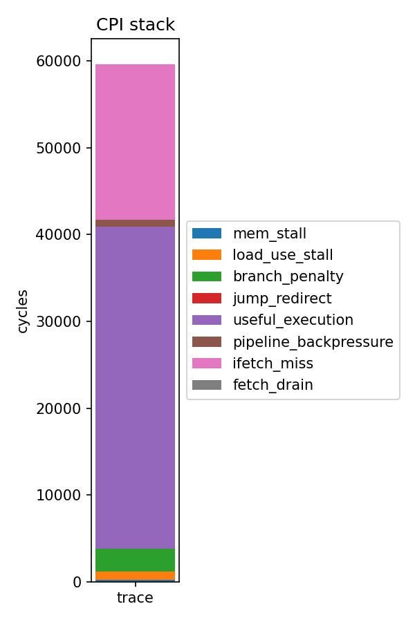

# PDP Project — Speeding up AES-128 on CV32E40P / PYNQ-Z1

TU Delft CESE — Processor Design Project (CESE4040). The goal of this project is to **speed up AES-128 (ECB) on a CV32E40P (RI5CY) soft-core running on the PYNQ-Z1**, by co-designing the hardware and the software/toolchain. The pre-optimization snapshot is preserved on the `baseline` branch for A/B comparison; `main` carries the current optimization state.

This README documents the optimizations implemented **so far**. Further optimizations are planned and the README will be updated as they land.

### optimizations currently in place

- **Two custom RISC-V scalar-crypto-style instructions** (`xaes32esmi`, `xaes32esi`) added to the core's ALU. Each fuses one AES byte-step (S-box + optional MixColumns + rotate + XOR) into a single combinational EX-stage op.
- **LLVM/clang toolchain extensions** that expose those instructions as `__builtin_riscv_…` intrinsics, so the C kernel emits them directly with no inline asm or library call.
- **A rewritten AES-128 ECB kernel** that uses the intrinsics to fuse the inner round and the final round, and a **`#pragma clang loop unroll(full)`** on the 9-iteration middle-round loop.

---

## Current optimizations (HW + Toolchain + Kernel)

| # | Technique | Where | Effect |
|---|-----------|-------|--------|
| 1 | `xaes32esmi` instruction in HW (S-box + MixColumns + rotate + XOR, combinational) | [cv32e40p_aes.sv](hardware/src/design/riscy/cv32e40p_aes.sv), [cv32e40p_alu.sv](hardware/src/design/riscy/cv32e40p_alu.sv) | Replaces software `sub_bytes` + `shift_rows` + `mix_columns` + `add_round_key` per byte-position with one ALU op |
| 2 | `xaes32esi` instruction in HW (S-box + rotate + XOR, no MixColumns) | [cv32e40p_aes_fi.sv](hardware/src/design/riscy/cv32e40p_aes_fi.sv) | Same fusion for the AES-128 final round (round 10), which omits MixColumns |
| 3 | Inner-round fusion (`aes_inner_round`) via chained `aes32esmi` | [main.c:114-149](software/main.c#L114-L149) | 4 chained calls per output column produce one whole AES round; the `(c+r) mod 4` indexing pattern is exactly ShiftRows |
| 4 | Final-round fusion (`aes_final_round`) via chained `aes32esi` | [main.c:154-185](software/main.c#L154-L185) | Same chained pattern, no MixColumns mix |
| 5 | LLVM full loop-unroll on the 9-iteration inner-round loop | [main.c:200-203](software/main.c#L200-L203) | `#pragma clang loop unroll(full)` flattens the round loop, removes round-counter increment and back-edge branch |
| 6 | Custom LLVM extensions `xaes32esmi`/`xaes32esi` (clang builtins → single insn) | [patches/llvm-xaes32esmi/](patches/llvm-xaes32esmi/), [patches/llvm-xaes32esi/](patches/llvm-xaes32esi/) | `-march=rv32imac_zicsr_xaes32esmi_xaes32esi` lowers the builtin directly to one encoded instruction (no library call, no inline asm) |

---

## Comparison with Baseline (this iteration)

The `baseline` branch contains the original purely-software AES-128 (sbox table lookup + GF(2⁸) `gf_mult` + `mix_columns` + `shift_rows`). The table below describes what the **current** round of optimizations *structurally removes* from the binary, relative to that baseline; numeric cycle-count comparison against a re-run trace is **pending** (see [Profiling & Methodology](#profiling--methodology) for how to capture it on `main`). Future optimizations will be compared incrementally on top of this state.

| Aspect | Baseline (`baseline` branch) | optimized (`main` branch) |
|---|---|---|
| ISA target | `-march=rv32imac_zicsr` | `-march=rv32imac_zicsr_xaes32esmi_xaes32esi` |
| `mix_columns` function | Hot — 86.86 % of retired instructions (32 247 / 37 124), 48 096 / ~59.6 k cycles (per [profile_attribution.csv](hardware/src/simulation/profile_attribution.csv)) | Eliminated from the binary — folded into HW MixColumns inside `cv32e40p_aes` |
| `gf_mult` (GF(2⁸) multiply) | Called 4×4×8 times per round per block; dominates the `slli`/`xor`/`srai`/`andi` opcode mix (≈ 70 % of dynamic insns per [profile_opcodes.csv](hardware/src/simulation/profile_opcodes.csv)) | Eliminated from the binary |
| `shift_rows` function | Explicit byte-shuffle | Eliminated — encoded in the `(c+r) mod 4` indexing inside `aes_inner_round` / `aes_final_round` |
| `sub_bytes` (256-byte S-box LUT) | Software table lookup per byte | Eliminated — S-box is the 256×8 LUT inside `cv32e40p_aes(_fi).sv` (synthesises to FPGA LUTs) |
| Inner-round control flow | Loop `for round in 1..9` with runtime counter and back-edge branch | Loop fully unrolled at compile time (`#pragma clang loop unroll(full)`) — counter + branch removed |
| HW cost added | — | Two combinational scalar-crypto units (`cv32e40p_aes`, `cv32e40p_aes_fi`) in the EX stage of the ALU, sharing the S-box pattern |
| Inner-round latency | Many tens of cycles per 16-byte block (software loop + GF mults + branches) | Each `aes32esmi`/`esi` retires in one ALU cycle (combinational); 16 ops per block per inner round + 16 per final round, no inner branch |


---

## Architecture

### Scalar-Crypto ALU Hooks

Both AES units sit inside [cv32e40p_alu.sv](hardware/src/design/riscy/cv32e40p_alu.sv) and run in parallel with the rest of the ALU; the mux on `result_o` selects one of them when `operator_i` is `ALU_AES32ESMI` or `ALU_AES32ESI`:

```systemverilog
// cv32e40p_alu.sv:86-103
logic [31:0] aes_result;
logic [31:0] aes_fi_result;

cv32e40p_aes aes_i (
    .rs1_i   (operand_a_i),
    .rs2_i   (operand_b_i),
    .bs_i    (imm_vec_ext_i),   // bs forwarded via the vec-imm channel
    .result_o(aes_result)
);

cv32e40p_aes_fi aes_fi_i (    // final-round, no MixColumns
    .rs1_i   (operand_a_i),
    .rs2_i   (operand_b_i),
    .bs_i    (imm_vec_ext_i),
    .result_o(aes_fi_result)
);
```

The 2-bit byte-select `bs` lives in `instr[31:30]` for both instructions. [cv32e40p_id_stage.sv:781-786](hardware/src/design/riscy/cv32e40p_id_stage.sv#L781-L786) routes it to the ALU through the otherwise-unused `imm_vec_ext` channel — no new pipeline wires required.

Internal control codes (not RISC-V opcodes) are added to `alu_opcode_e` in [cv32e40p_pkg.sv:167-173](hardware/src/design/riscy/include/cv32e40p_pkg.sv#L167-L173):

```systemverilog
ALU_AES32ESMI = 7'b1000000,
ALU_AES32ESI  = 7'b1000001
```

### Instruction Decoding

[cv32e40p_decoder.sv:601-629](hardware/src/design/riscy/cv32e40p_decoder.sv#L601-L629) matches both instructions inside `OPCODE_OP` (`0x33`) **before** the PULP bit-manip / vec-FP branches, because `bs` occupies `instr[31:30]` and would otherwise alias with those decode prefixes:

| Instruction | `funct3` (`instr[14:12]`) | `funct5` (`instr[29:25]`) | `bs` (`instr[31:30]`) | Base opcode |
|---|---|---|---|---|
| `xaes32esmi` | `3'b000` | `5'b10011` | 2 bits | `0110011` |
| `xaes32esi`  | `3'b000` | `5'b10001` | 2 bits | `0110011` |

These encodings are bit-identical to the standard Zkne `aes32esmi`/`aes32esi`; the custom feature flag in the LLVM patches exists only so the instruction can be enabled without pulling in the rest of Zkne.

### `aes32esmi` Datapath ([cv32e40p_aes.sv](hardware/src/design/riscy/cv32e40p_aes.sv))

Purely combinational. For each byte-select `bs ∈ {0,1,2,3}`:

```
sb_in       = rs2[bs*8 +: 8]                       # byte select
sb_out      = SBox_fwd(sb_in)                      # 256×8 LUT
xtime(s)    = (s << 1) ^ (s[7] ? 0x1b : 0)         # GF(2^8) ×2
mixcol_word = {3·s, 1·s, 1·s, 2·s}                 # forward MixColumns column
rotated     = rot_left(mixcol_word, bs*8)
result_o    = rs1 ^ rotated
```

The MixColumns expansion `{3s, s, s, 2s}` is built directly from `xtime(s)` and `xtime(s) ^ s` — no GF multiplier, just an XOR and a shift. The result feeds back into the ALU result mux in the same EX cycle.

### `aes32esi` Datapath ([cv32e40p_aes_fi.sv](hardware/src/design/riscy/cv32e40p_aes_fi.sv))

Same shape as `aes32esmi` but with no MixColumns:

```
sb_word  = zext32(SBox_fwd(rs2[bs*8 +: 8]))        # sbox byte at byte-0
rotated  = rot_left(sb_word, bs*8)                  # place sbox byte at byte bs
result_o = rs1 ^ rotated
```

The two units share the S-box LUT pattern but are instantiated independently so the synthesis tool can fold/share at its discretion.

### Software Inner-Round Fusion

[main.c:114-149](software/main.c#L114-L149) implements one full middle round as four chained `aes32esmi` calls per output column:

```c
// Column 0: rows from input columns 0,1,2,3 (= (c+r) mod 4 for c=0)
c0 = kw[0];
c0 = aes32esmi(c0, in0, 0);
c0 = aes32esmi(c0, in1, 1);
c0 = aes32esmi(c0, in2, 2);
c0 = aes32esmi(c0, in3, 3);
// …c1, c2, c3 follow the same (c+r) mod 4 pattern.
```

The `(c+r) mod 4` index pattern across the four chained calls *is* ShiftRows; we get it for free in the way we pick which `in*` to feed in. The accumulator `c0` is seeded with the round key, so `AddRoundKey` is also folded in.

The 9-iteration loop over middle rounds is fully unrolled by clang:

```c
#pragma clang loop unroll(full)
for (int round = 1; round < 10; round++)
    aes_inner_round(state, &round_keys[round * 16]);
```

`aes_final_round` ([main.c:154-185](software/main.c#L154-L185)) follows the identical pattern but uses `aes32esi` — the only difference is that the final round has no MixColumns step.

### Toolchain Wiring

[software/include/aes_intrinsics.h](software/include/aes_intrinsics.h) wraps the clang builtins behind a `bs`-runtime-safe switch — the builtin requires a *compile-time-constant* `bs`, and the 4-way switch lets call sites pass a literal so the compiler collapses each call back to one instruction:

```c
static inline uint32_t aes32esmi(uint32_t rs1, uint32_t rs2, int bs) {
    switch (bs & 0x3) {
    case 0:  return __builtin_riscv_xaes32esmi(rs1, rs2, 0);
    case 1:  return __builtin_riscv_xaes32esmi(rs1, rs2, 1);
    case 2:  return __builtin_riscv_xaes32esmi(rs1, rs2, 2);
    default: return __builtin_riscv_xaes32esmi(rs1, rs2, 3);
    }
}
```

The LLVM TableGen patches that add the builtin and lower it to the encoding above are documented per-file in [patches/llvm-xaes32esmi/README.md](patches/llvm-xaes32esmi/README.md) and [patches/llvm-xaes32esi/README.md](patches/llvm-xaes32esi/README.md).

---

## Implementation Results (OOC Synth, Vivado, PYNQ-Z1)

The Vivado OOC-synth flow described under [Hardware: Vivado project and RTL](#build--bring-up) produces utilisation and timing reports under `hardware/vivado/ooc_riscy/ooc_riscy.runs/ooc_synth/`. **Quantitative area/timing numbers (LUTs, FFs, BRAMs, WNS) will be updated here**.

---

## Custom Instruction Encodings

Both instructions reuse the standard RV32I `OP` opcode (`0110011`) and `funct3=000`. They are disambiguated from PULP bit-manip / vec-FP and from each other by `funct5` (`instr[29:25]`):

```
 31  30 29     25 24  20 19  15 14  12 11   7 6     0
+----+--------+------+------+------+------+-------+
| bs | funct5 | rs2  | rs1  | 000  | rd   |0110011|
+----+--------+------+------+------+------+-------+
       10011   xaes32esmi
       10001   xaes32esi
```

`bs` (byte-select, 0..3) lives in `instr[31:30]`. Encodings are bit-identical to the standard Zkne `aes32esmi`/`aes32esi`; the custom `xaes32esmi`/`xaes32esi` feature names in LLVM only exist so we can enable them without enabling the rest of Zkne.

---


## Profiling & Methodology

The profiling pipeline reuses the per-cycle trace produced by [zynq_tb.sv](hardware/src/simulation/zynq_tb.sv) during RTL simulation and the linker symbol map produced by `make soft`.

### CPI-stack categories ([cpi_stack.py](software/python_script/cpi_stack.py))

Each cycle of `pipeline_trace.csv` is classified into exactly one bucket (priority-ordered, first match wins):

| Bucket | Condition |
|---|---|
| `mem_stall` | `data_req && !data_gnt` |
| `load_use_stall` | `id_stage.load_stall_o` (load-use RAW) |
| `jr_stall` | `id_stage.jr_stall_o` (JR hazard on rs1) |
| `misaligned_stall` | `id_stage.misaligned_stall_o` (split LSU access) |
| `branch_penalty` | `pc_set && branch_dec` (taken branch flush) |
| `jump_redirect` | `pc_set && !branch_dec` (JAL/JALR/exception) |
| `useful_execution` | `is_decoding && id_ready` (instr advanced) |
| `pipeline_backpressure` | `is_decoding && !id_ready` (downstream stall) |
| `ifetch_miss` | `!instr_valid_id && (if_busy || perf_imiss)` |
| `fetch_drain` | post-flush refill, `!instr_valid_id && !if_busy` |
| `other_bubble` | everything else |

The baseline CPI stack is checked in at `cpi_stack_baseline.png`:

<p align="center">
  
</p>

Total ≈ 59 590 cycles for the baseline run, dominated by `useful_execution` (~37 k) and `ifetch_miss` (~18 k). The large `ifetch_miss` slice reflects the 2-cycle BRAM read latency on the instruction memory port.

### Dynamic instruction & function profiling ([dynamic_profile.py](software/python_script/dynamic_profile.py))

For every cycle where an instruction retires (`is_decoding && id_ready`), the script attributes the retire to a function (via `software/aes.map` symbol ranges, looking up `pc_id`) and an opcode mnemonic (decoded from the raw `instr` bits, RV32IMC + Zicsr). Outputs the per-function `profile_attribution.csv` and per-mnemonic `profile_opcodes.csv` shown above.

---

## Build & Bring-up

This section is a condensed working reference. Detailed PYNQ board setup and server-environment instructions live in the [Run server](#run-server) / [Run locally](#run-locally) subsections below.

### Toolchain

| Tool | Where it lives | Build |
|---|---|---|
| RISC-V GCC | server: `/data/mirror/riscv` (`riscv32-unknown-elf`) | upstream `riscv-gnu-toolchain`, `--with-arch=rv32gc --with-abi=ilp32d` |
| LLVM/clang (custom) | server: `/data2/home/cese4040-10/Desktop/compiler/llvm/build-release` | upstream LLVM `f351172d…` + patches in `patches/llvm-xaes32esmi/` and `patches/llvm-xaes32esi/` |
| Vivado | local | 2024.2, free edition (PYNQ-Z1 target) |

Apply the LLVM patches and rebuild only the RISCV backend:

```sh
cd /path/to/llvm-project
git checkout f351172d4a840dfbf533319b62925747a10b762f
git apply /path/to/pdp-project/patches/llvm-xaes32esmi/*.patch
git apply /path/to/pdp-project/patches/llvm-xaes32esi/*.patch
cd build-release
cmake -G Ninja \
  -DLLVM_TARGETS_TO_BUILD="RISCV" \
  -DLLVM_ENABLE_PROJECTS="clang;lld" \
  -DCMAKE_BUILD_TYPE=Release \
  -DLLVM_BUILD_TESTS=OFF -DLLVM_INCLUDE_TESTS=OFF "../llvm/"
ninja -j4   # NB: bare `ninja` OOMs the procdesign server
```

### Software build

```sh
cd software
make soft
```

Generates `output/soft.elf` + `soft.srec`, then `bin_files/code.coe` and `bin_files/data.coe`, and copies the COE files into both `hardware/src/sw/mem_files/` (simulation) and `hardware/src/sw/fpga/riscy/mem_files/` (FPGA overlay). The active config — `software/config/rv32-standard.conf` — pins `-march=rv32imac_zicsr_xaes32esmi_xaes32esi` and `-Os`.

### Hardware bring-up (Vivado)

All scripts assume your working directory is `pdp-project/hardware/`. From the Vivado tcl console:

```tcl
cd ./pdp-project/hardware
source ./scripts/create_project.tcl          # base block-design + sources
source ./run_simulation.tcl                  # behav sim, dumps pipeline_trace.csv
source ./run_synth_impl.tcl                  # full synth/impl, generates bitstream
source ./scripts/gen_bitstream.tcl           # one-shot: create_project + bitstream
source ./create_project_ooc_synth.tcl        # OOC synth of the core (timing/area)
```

Generated products:

- Full-project bitstream: `pdp-project/hardware/vivado/riscy/riscy.runs/impl_1/`
- Hardware hand-off file (for the PYNQ overlay): `pdp-project/hardware/vivado/riscy/riscy.gen/sources_1/bd/riscv/hw_handoff/riscv.hwh`
- OOC reports (timing/utilisation): `pdp-project/hardware/vivado/ooc_riscy/ooc_riscy.runs/ooc_synth/`

### Running on the PYNQ-Z1

- Board setup: [PYNQ-Z1 setup](https://pynq.readthedocs.io/en/latest/getting_started/pynq_z1_setup.html)
- Set a static IP on your PC: [assign static IP](https://pynq.readthedocs.io/en/latest/appendix/assign_a_static_ip.html#assign-a-static-ip-address)
- Connect at `http://192.168.2.99/` (browser) or `ssh xilinx@192.168.2.99` (username/password `xilinx`/`xilinx`)
- The base notebook is at `hardware/src/sw/fpga/riscy/base_riscy.ipynb`; bitstream + hand-off + tcl go under `overlays/`, and the COE files go under `mem_files/`. After regenerating the bitstream, copy and rename `riscv_wrapper.bit`/`.tcl` to `base_riscy.bit`/`.tcl`, plus the matching `.hwh`.

### Run server

QCE provides a shared server (`ce-procdesign01.ewi.tudelft.nl`) reachable over X2GO ([setup](https://qce-it-infra.ewi.tudelft.nl/faq.html#how-to-setup-x2go-for-the-qce-xportal-server)); VPN required from outside TU Delft. Sessions auto-logout after 4 h. Tools live under `~/course`; copy the project locally before editing:

```sh
cp -r ~/course/pdp-project ~/pdp-project
cp -r ~/course/llvm        ~/llvm
# then point software/config/rv32-standard.conf at your local LLVM build
```

### Run locally

Locally you need Vivado 2024.2, the RISC-V GCC toolchain ([riscv-gnu-toolchain](https://github.com/riscv-collab/riscv-gnu-toolchain)), and a patched LLVM (build commands above). The free Vivado edition is sufficient for the PYNQ-Z1.

---

## Branches

| Branch | Contents |
|---|---|
| `main` | Current optimization state: HW `xaes32esmi`/`xaes32esi` + chained-intrinsic inner & final round + LLVM full unroll on the round loop. Further optimizations will land here. |
| `baseline` | Snapshot of pre-optimization `main` — software-only AES, no custom instructions, no LLVM patches |
| `dev`, `dev-esmi` | Intermediate work branches (CPI-stack tooling, Section 1C profiling, ESMI-only path) |

---

## Resources

- [RISC-V Cryptography Extension (Zkn scalar draft)](https://lists.riscv.org/g/dev-partners/attachment/43/0/riscv-crypto-spec-scalar-v0.9.3-DRAFT.pdf)
- [Adding a custom instruction to the LLVM backend](https://github.com/10x-Engineers/clang-builtin-tutorial)
- [PYNQ-Z1 board setup](https://pynq.readthedocs.io/en/latest/getting_started/pynq_z1_setup.html)
- [X2GO setup for QCE servers](https://qce-it-infra.ewi.tudelft.nl/faq.html#how-to-setup-x2go-for-the-qce-xportal-server)
